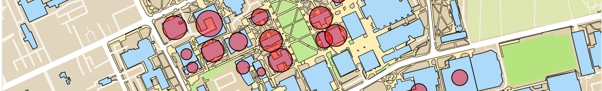

## Modeling students on the UNC-CH campus for fall 2020 restart scenarios
### By Andrew Maxwell and Davis Brown

Adapting classrooms and course schedules to properly offer social distancing is crucial to bringing university students back to campus. On May 21, UNC-Chapel Hill Chancellor Kevin Guskiewicz announced the University’s roadmap plan for the fall 2020 semester. Responding to the COVID-19 pandemic, this plan detailed sweeping changes made to UNC classrooms to promote safe environments for all students. Our aim with this analysis is to offer insight into how changing course schedules may impact the number of student-to-student interactions on campus. 

### Risk of COVID-19 in Classrooms, Based on Class Size 
Maintaining social distance between individuals is essential to reducing the spread of the COVID-19 virus. [^1] [^2] Using a tool from Georgia Tech, Stanford University, and the Applied Bioinformatics Laboratory, we can estimate the chance that a person in a group is infected with COVID-19. [^3] If we use the current number of incident COVID-19 cases in North Carolina, we can find the probability that one or more people in a classroom or group on campus is infected with COVID-19. For example, the largest course UNC-CH offered in fall 2019 was CHEM 101 with 421 registered students in a lecture. Given the current tested prevalence in North Carolina, there is a 34% chance that a student in only this class is infected with COVID-19. For course sizes of 100 students, the chance that a student is infected with COVID-19 in the course is 9.4%. For a course size of 50 students, the chance that a student has COVID-19 is still as high as 4.8%. You can check out the graphic below to see the chance a student will have COVID-19 under different class sizes.

<body>
 

<noscript></noscript><object class='tableauViz'  style='display:none;'><param name='host_url' value='https%3A%2F%2Fpublic.tableau.com%2F' /> <param name='embed_code_version' value='3' /> <param name='site_root' value='' /><param name='name' value='ClassProbabilities&#47;Dashboard1' /><param name='tabs' value='no' /><param name='toolbar' value='yes' /><param name='static_image' value='https:&#47;&#47;public.tableau.com&#47;static&#47;images&#47;Cl&#47;ClassProbabilities&#47;Dashboard1&#47;1.png' /> <param name='animate_transition' value='yes' /><param name='display_static_image' value='yes' /><param name='display_spinner' value='yes' /><param name='display_overlay' value='yes' /><param name='display_count' value='yes' /></object>
                
 </body>

&nbsp;

There were 370 courses with over 50 students in a classroom in fall 2019 at UNC-CH. When we consider all of the courses offered on the UNC-CH campus, it is a near certainty (>99% chance using the above model) that students in classrooms at UNC-CH will have COVID-19. There is a high likelihood that even some small classes will have students with COVID-19. Because there are many potential student-to-student interactions in classrooms, there are also a high number of potential spreading events. While there are many other variables on campus that need to be controlled for a safe campus restart, we focus on course schedule as an effective, straightforward, and cost-effective way to limit the exponential spread of COVID-19 from in-class student interactions. 

### Scenarios Considered
We have used some of the changes suggested by Chancellor Guskiewicz and other university systems to anticipate possible scenarios. We examine three different scenarios: 

1. Limit classes to only those with 50 students or fewer. There were 370 courses offered with over 50 students in fall 2019. To limit student-to-student interactions and mitigate the exponential spread of COVID-19, we consider a scenario where these classes are held online.
2. Limit classes to only those with 100 students or fewer. We consider a scenario where the 178 courses offered with over 100 students are held online. 
3. Extend the overall class schedule to offer more weeknight classes. We sample ¼ of the courses offered during the campus population peak hours between 11am - 3pm and move them to either a later time (between 5pm and 8pm) or to an earlier time (8 am) to reduce the density of students on campus. 

Our model provides insight on how each proposed change would impact the total number of students on campus, the total density of students within buildings on campus, and the density of student seating. We consider the student density within the Chapel Hill campus. 

### Mapping Weekly Student In-Class Density on Campus
Below is a geospatial plot of students on campus throughout the week (press the triangle pointing right to play the animation through a week of courses). We offer the option of ‘layering’ restart scenarios: for example, you can view the student density on campus where classes are limited to 50 students or less, or where there are more weeknight courses offered, or where both classes are limited to 50 students AND more weeknight courses are offered. The total students on campus at a given time is shown in the header. 

<body>
 
 
<noscript>
  </noscript>
  <object class='tableauViz'  style='display:none;'><param name='host_url' value='https%3A%2F%2Fpublic.tableau.com%2F' /> <param name='embed_code_version' value='3' /> 
   <param name='site_root' value='' />
   <param name='name' value='CoursesTableau_v2&#47;Dashboard1' />
   <param name='tabs' value='no' />
   <param name='toolbar' value='yes' />
   <param name='static_image' value='https:&#47;&#47;public.tableau.com&#47;static&#47;images&#47;Co&#47;CoursesTableau_v2&#47;Dashboard1&#47;1.png' /> <param name='animate_transition' value='yes' /><param name='display_static_image' value='yes' /><param name='display_spinner' value='yes' /><param name='display_overlay' value='yes' /><param name='display_count' value='yes' /></object>
                
 </body>

&nbsp;

We observe large clusters of students at peak hours. These clusters are mostly concentrated in the buildings between Cameron Ave and South Rd. As noted, this high population density creates more student-to-student interactions and fosters the exponential spread of COVID-19. By limiting class size to 50 and extending class hours, we are able to reduce the on-campus population in this area from over 9400 students to less than 3600, limiting potential virus transmissions.  

In the next graphic, we note the consistent decrease of student population densities under the scenarios. Namely, within peak times of 11am - 3pm, we notice a decrease of student population on campus by over 5,000 students. With the most aggressive change to class schedules, we observe at least one instance on Monday-Thursday of a greater than 10,000 student decrease in campus in-class population (e.g. Tuesday at 12pm). This may mitigate the exponential spread of COVID-19. The potential for student-to-student spread decreases as class times are either spread out or the classes with the greatest potential to enable spread are moved online. We graph the total student population on the UNC-CH campus under different strategies or combinations of strategies below. The plot allows direct comparison of the total student population on campus with and without a chosen strategy. Each proposed change to the course schedule can be compared on an hour to hour basis for each day of the week. We highlight the standard course hours in blue and the extended course hours (later hours for weeknights) in yellow.

<body>
 

<noscript></noscript><object class='tableauViz'  style='display:none;'><param name='host_url' value='https%3A%2F%2Fpublic.tableau.com%2F' /> <param name='embed_code_version' value='3' /> <param name='site_root' value='' /><param name='name' value='TimePeakReduction&#47;Dashboard1' /><param name='tabs' value='no' /><param name='toolbar' value='yes' /><param name='static_image' value='https:&#47;&#47;public.tableau.com&#47;static&#47;images&#47;Ti&#47;TimePeakReduction&#47;Dashboard1&#47;1.png' /> <param name='animate_transition' value='yes' /><param name='display_static_image' value='yes' /><param name='display_spinner' value='yes' /><param name='display_overlay' value='yes' /><param name='display_count' value='yes' /></object>
                
</body>

&nbsp;

### Mapping Student In-Class Density per Building
The next graphic displays the scenarios in a similar manner but replaces time with buildings. This graphic is a snapshot of the peak campus population, on Tuesday at 12pm. In the scenarios limiting classes to under 50 students, certain buildings with large lecture halls experience major decreases in population such as Genome Sciences, Phillips Hall, and Chapman Hall. On the other hand, Dey Hall and Peabody Hall remain relatively unchanged, suggesting they have many classes with under 50 individuals. By moving large lecture classes online, these large classrooms could be used to adequately social distance students for in-person lectures. 

<body>
 
 
<noscript></noscript><object class='tableauViz'  style='display:none;'><param name='host_url' value='https%3A%2F%2Fpublic.tableau.com%2F' /> <param name='embed_code_version' value='3' /> <param name='site_root' value='' /><param name='name' value='BuildingPeakReductions&#47;Dash' /><param name='tabs' value='no' /><param name='toolbar' value='yes' /><param name='static_image' value='https:&#47;&#47;public.tableau.com&#47;static&#47;images&#47;Bu&#47;BuildingPeakReductions&#47;Dash&#47;1.png' /> <param name='animate_transition' value='yes' /><param name='display_static_image' value='yes' /><param name='display_spinner' value='yes' /><param name='display_overlay' value='yes' /><param name='display_count' value='yes' /></object>
                
</body>

&nbsp;

### Utilization of Academic Buildings per Classroom Seat
Finally, we consider how many open and filled (‘used’) seats each building on campus has during the course week. We call the building’s open seats and used seats the ‘utilization’ of the building. Utilization describes student density in a building at the per seat level. This gives us more information about the potential for student-to-student interaction than student density per building alone, as we can now graphically consider how tightly packed students are in the classroom. We can also make better decisions about where to allocate students on campus.

For example, in the utilization graphic below, the Genome Sciences Building has 846 used seats and 29 open seats on a Tuesday at 12:00 pm. When we implement a layered strategy of extended night hours during the weeknight and also limit classes to less than 50 students, we notice that Genome now has only 149 used seats and 726 open seats. This suggests that our intervention is effective at the per seat level. Importantly, it also suggests a further strategy: we can move other classes (from, e.g. Phillips Hall, which has 356 used seats) on campus to some of the empty seats in Genome, and still have reasonably low student-to-student interactions given the utilization rate of the building.

<body>
 

<noscript></noscript><object class='tableauViz'  style='display:none;'><param name='host_url' value='https%3A%2F%2Fpublic.tableau.com%2F' /> <param name='embed_code_version' value='3' /> <param name='site_root' value='' /><param name='name' value='Utilization_v2&#47;Dashboard1' /><param name='tabs' value='no' /><param name='toolbar' value='yes' /><param name='static_image' value='https:&#47;&#47;public.tableau.com&#47;static&#47;images&#47;Ut&#47;Utilization_v2&#47;Dashboard1&#47;1.png' /> <param name='animate_transition' value='yes' /><param name='display_static_image' value='yes' /><param name='display_spinner' value='yes' /><param name='display_overlay' value='yes' /><param name='display_count' value='yes' /></object>
                
</body>

## Conclusions and Further Considerations 
Using projected changes to the UNC-CH course schedule to decrease the possibility of student-to-student COVID-19 spread in the classroom, we consider three strategies to mitigate in-class interactions: limiting class sizes to >50 and >100 students, extending course hours till 8 pm, and layering combinations of these strategies. We find a decrease of campus student population density with all strategies. The most significant decrease of student density on campus occurs with the combination of extending class hours and moving classes with over 50 students online. 

We had a narrow focus in this analysis. However, we suggest that UNC-CH will have success in decreasing the spread of COVID-19 by layering many strategies at once. Our work also demonstrates that even simple measures will decrease student density at the per seat level, within buildings, and on campus. Further direct work should consider how to optimize individual classrooms and classroom spaces to reduce clustering. Further work may also consider a network analysis of potential student-to-student spread in UNC-CH classrooms, and what strategies may best reduce this risk. 

Other potential COVID-19 related interventions to prevent risky clusters of students: 
* reroutes of student paths to avoid overcrowding, 
* cleaning of building entrances and facilities, and
* limiting students stopping-off in cafeterias, libraries, and recreational spaces.
Reducing students on campus may limit the risk of these issues but will not curb them.

### Methods
We use UNC Chapel Hill course enrollment data from fall 2019 provided by the [Office of the University Registrar](https://registrar.unc.edu/files/2019/03/2199-SSB-3-4-19.pdf). 

For the two strategies that limit course sizes over 50 or 100 students, we remove these courses from the course schedule and assume they are held online. For the extension of course hours to add weeknight classes, we sample between peak student density hours of 11:00am to 3:00pm. We randomly sample 1/4 of courses less than 1.5 hours. If the sampled course starts at 11:00 am, we move the course to 8:00 am. For other sampled courses, we move it 5 hours after its original starting time, so a course that originally started at 2:00 pm and ended at 2:50 pm will now start at 7:00 pm and end at 7:50 pm. 

We use Tableau and pandas for the data analysis and visualization. 

[^1]: https://www.ncbi.nlm.nih.gov/pmc/articles/PMC7118670/
[^2]: https://wwwnc.cdc.gov/eid/article/26/8/20-1093_article
[^3]: https://covid19risk.biosci.gatech.edu/

### Biographies
**Andrew Maxwell** is a 2020 graduate from UNC with a B.S. in public health from Gillings. Andrew currently works as a research assistant for Cecil G. Sheps Center for Health Services Research. In October 2020, he will start work as an associate at Boston Consulting Group (BCG). 

**Davis Brown** is a 2020 graduate from UNC with a B.S. in physics. Davis has recently performed research in material science and at the intersection of machine learning and geospatial analysis. He currently works as a machine learning engineer on a project basis. 

### Acknowledgements
We would like to acknowledge Professor Morris Weinberger for considerably helpful discussion and suggestions on the campus restart. We also thank Kristie Thompson from the Sheps Center for Health Services Research for detailed feedback and input. Finally, we thank Shreya Shah, Olivia Zitkus, and Caroline Leland for editing and feedback. 

